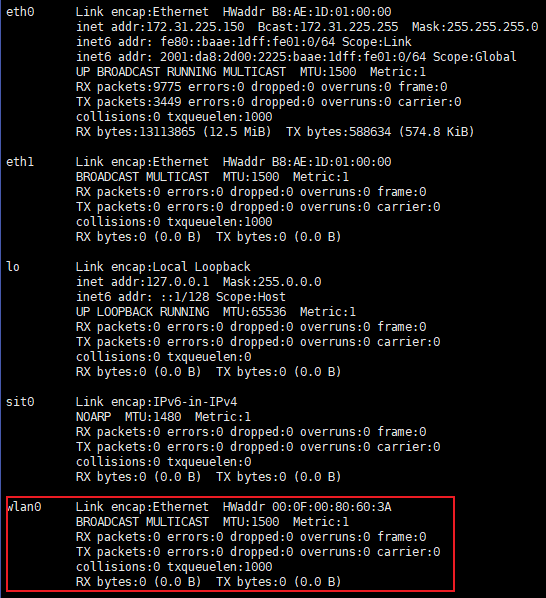
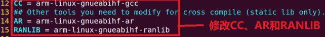
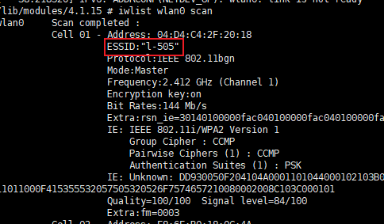
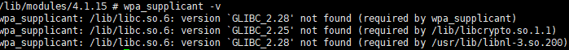

## 	wifi驱动
### 1.删除linux内核中的RTL8192CU驱动，在linux-4.1/driver/net/wireless/rtlwifi/Kconfig
### 2.drivers/net/wireless/rtlwifi/Makefile 
>		obj-$(CONFIG_RTL8192CU) += rtl8192cu/  注释掉或者删掉

###	 3.将realtek放到linux-4.1/driver/net/wireless/下

###  4.linux-4.1/driver/net/wireless/Kconfig下添加 source "drivers/net/wireless/realtek/Kconfig"

###  5.linux-4.1/driver/net/wireless/Makefile 下添加obj-y += realtek/
这里-y是编译进内核，-m是编译成模块，按道理都可以

###  6.make menuconfig，勾选编译选项

>	 	Device Drivers
			-> <*> USB support
			-> <*> Support for Host-side USB
			-> <*> EHCI HCD (USB 2.0) support
			-> <*> OHCI HCD (USB 1.1) support
			-> <*> ChipIdea Highspeed Dual Role Controller
				-> [*] ChipIdea device controller
				-> [*] ChipIdea host controller

>		Device Drivers
		-> [*] Network device support
		-> [*] Wireless LAN
			-> <*> IEEE 802.11 for Host AP (Prism2/2.5/3 and WEP/TKIP/CCMP)
				-> [*] Support downloading firmware images with Host AP driver
				-> [*] Support for non-volatile firmware download

>		-> Networking support
			-> -*- Wireless
				-> [*] cfg80211 wireless extensions compatibility
				-> <*> Generic IEEE 802.11 Networking Stack (mac80211)

>		-> Device Drivers
			-> Network device support (NETDEVICES [=y])
				-> Wireless LAN (WLAN [=y])
					-> Realtek wifi (REALTEK_WIFI [=m])
						-> rtl8189ftv sdio wifi
						-> rtl8188eus usb wifi
						-> Realtek 8192C USB WiFi

###  7.make zImage -j8 和 make modules -j8 生成 8189fs.ko 、8188eu.ko 、8192cu.ko
没有出现8188eu.ko文件，但是中间编译的文件8188eu.o以及一些其他文件存在。是为什么呢？跟进查看。

发现在wireless/rtlwifi/下有同名的RTL8188EUS目录，说明是和linux中自带的驱动冲突了，通过make menuconfig查看
>		Device Drivers
		-> [*] Network device support
		-> [*] Wireless LAN
			-> <M> Realtek rtlwifi family of devices
				-> <M> Realtek RTL8188EUS USB wireless network Adapter

此驱动和我们的realtek/rtl8188eus usb wifi冲突，尝试将自己添加的驱动进行改名，添加后缀_tt，但是并没有效果，仍然会跑到系统的8188EUS目录内编译生成8188eu.ko

但是将Realtek RTL8188EUS USB wireless network Adapter取消的话会导致两个8188EUS都不会被编译。取消这个会导致Realtek wifi选项里的8188eus也默认取消掉。

最终选择和上面做法想法，直接找到该同名的驱动，删掉。

##### 原因：其他两个没有同名目录，所以能直接编译.ko文件

##### rtl8188EUS 在rtlwifi/Kconfig下有同名的驱动， 需要删除掉

##### 进入linux-4.1/drivers/net/wireless/rtlwifi/Makefile  将  # obj-$(CONFIG_RTL8188EUS)  += rtl8188EUS/ 删掉或者注释掉即可。

###  8.用新的zImage启动板子，将几个.ko文件装载后，用ifconfig -a命令查看，可以看到wlan0字段：

### 驱动安装好了，接着安装其他工具检测和使用wifi
#### wireless tools
找个地方解压iwlist_for_visteon-master.tar.bz2，修改里面的Makefile文件

输入make clean，然后输入make编译
>		sudo cp iwlist iwconfig iwspy iwpriv ifrename /home/tt/Desktop/driver_banzi/nfs/rootfs/usr/bin/ -f
>		sudo cp libiw.so.29 /home/tt/Desktop/driver_banzi/nfs/rootfs/usr/lib/ -f

重启板子，将驱动模块装载后

输入命令 ifconfig wlan0 up 以及 iwlist wlan0 scan

可以看到能够检测到505这个wifi

####  wpa_supplicant 工具移植

解压openssl-1.1.1d.tar.gz

新建一个文件夹
>		mkdir openssl 
当前目录下有openssl-1.1.ld 和 openssl两个文件夹
>		cd openssl-1.1.ld
>		./Configure linux-armv4 shared no-asm --prefix=/home/tt/Desktop/driver_banzi/rtl8xxx-wifi/tool/openssl CROSS_COMPILE=arm-linux-gnueabihf-
prefix路径改成自己刚刚创建的openssl文件夹的绝对路径名。

>		make
>		make install

make失败的话在Makefile里将交叉编译器相关的给修改一下，改成arm-linux-gnueabihf-xx, 

然后make make install

解压libnl-3.2.23.tar.gz
>		mkdir libnl
>		cd libnl-3.2.23
>		./configure --host=arm-linux-gnueabihf --prefix=//home/tt/Desktop/driver_banzi/rtl8xxx-wifi/tool/libnl/        # 路径换成自己的libnl
>		make
>		make install
make失败的话在Makefile里将交叉编译器相关的给修改一下，改成arm-linux-gnueabihf-xx, 

解压wpa_supplicant-2.7.tar.gz
>		cd wpa_supplicant-2.7
>		cd wpa_supplicant/
>		cp defconfig ./config
>		vim .config
添加如下：
>		CONFIG_LIBNL32=y

>		CC = arm-linux-gnueabihf-gcc
>		CFLAGS += -I/home/tt/Desktop/driver_banzi/rtl8xxx-wifi/tool/openssl/include
>		LIBS += -L/home/tt/Desktop/driver_banzi/rtl8xxx-wifi/tool/openssl//lib -lssl -lcrypto
>		 
>		CFLAGS += -I/home/tt/Desktop/driver_banzi/tool/libnl/include/libnl3
>		LIBS += -L/home/tt/Desktop/driver_banzi/tool/libnl/lib
保存退出，输入
>		export PKG_CONFIG_PATH=/home/tt/Desktop/driver_banzi/rtl8xxx-wifi/tool/libnl/lib/pkgconfig:$PKG_CONFIG_PATH
>		make
>		sudo cp wpa_cli wpa_supplicant /home/tt/Desktop/driver_banzi/nfs/rootfs/usr/bin/ -f
重启板子

输入 wpa_supplicant -v

通过 strings /lib/libc.so.6 | grep GLIBC_ 查看，确实没有2.28和2.25

libc.so.6这个版本不行，但是板子没有解压/编译等功能，应该需要重新构建根文件系统，教程镜像的根文件系统不行了。

尝试寻找新的交叉编译器版本，在ubuntu的/usr/local/arm下的交叉编译器arm-linux-gnueabihf-gcc版本是4.9.4，但是换了几个6.几的也是没有GLIBC_2.28版本。

尝试失败。

